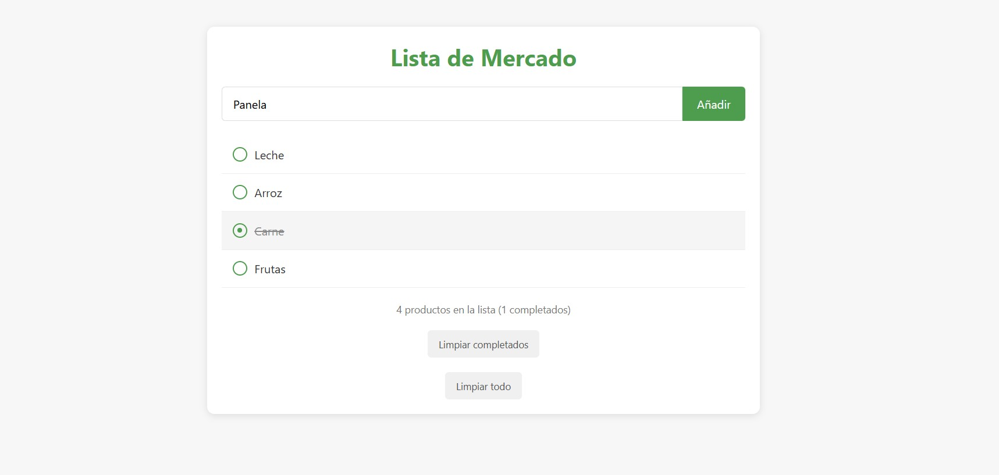

# Lista de Mercado

Una aplicación web simple pero efectiva para gestionar tus compras en el supermercado. Esta herramienta te permite crear una lista de productos, marcarlos como completados (tachándolos) mientras haces las compras, y mantener un registro organizado de tus necesidades.

## 📋 Características

- **Interfaz intuitiva**: Diseño limpio y amigable que facilita su uso
- **Agregar productos**: Añade fácilmente nuevos productos a tu lista
- **Marcar como completados**: Tacha los productos a medida que los compras (sin eliminarlos)
- **Persistencia de datos**: Tu lista se guarda automáticamente en el navegador
- **Contador de productos**: Visualiza cuántos productos tienes en total y cuántos has completado
- **Opciones de limpieza**: Botones para eliminar productos completados o toda la lista
- **Diseño responsivo**: Funciona perfectamente en dispositivos móviles, tabletas y computadoras

## 🚀 Cómo usar

1. **Agregar un producto**: 
   - Escribe el nombre del producto en el campo de texto
   - Presiona el botón "Añadir" o la tecla Enter

2. **Marcar un producto como completado**:
   - Haz clic en el producto para tacharlo
   - Haz clic nuevamente para desmarcarlo

3. **Limpiar productos**:
   - Usa el botón "Limpiar completados" para eliminar solo los productos tachados
   - Usa el botón "Limpiar todo" para eliminar toda la lista

